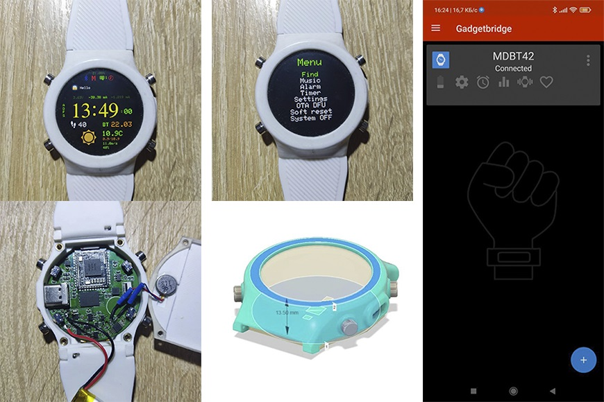

# nRF52-Smartwatch

## The instructions will be updated
Here you can find PCB files, software and some instructions.

Due to the current situation in Ukraine, I cannot continue working on the project at the moment, as soon as the war ends I will continue to work, you can support the project by donating to a crypto wallet or Patreon:

* BTC 1Fx1nvSsfxKMsXz7BsxxJzk7NQdWSS86Fd
* ETH 0xfeb67dc42bdb4252a39f2cb6f8ca42f192d4d32d

# In Future
* Go to more available components
* Make other buttons for case(I bought buttons in a local store, but in Ukraine there is a war with Russia and the store will not work)
* Add NFC antena
* Add a pulse oximeter(MAXM86146)
* Draw more app and weather icons
* Using other displays

# Hardware

* nRF52840(Holyiot-18010)
* 240x240 IPS Display(GC9A01)
* BMA423 Accel(Steps and tilt wrist)
* 8Mb QSPI Flash Memory
* USB Type-C for programming and access to flash memory
* 4 Hardware Buttons
* MAX17055 1-Cell Fuel Gauge
* 500mAh LiPo battery
* DRV2605L Haptic Motor Controller 
* Small size

# Software

* Shows time
* Call notifications
* Message notifications
* Over 7-day battery life with BLE connected
* Gadgetbridge support
* BLE communication secured with passkey comparison pairing
* Current weather
* Music player control
* Flashlight mode
* Find phone function
* OTA update

# You will need to install:
-[Arduino Core for Adafruit Bluefruit nRF52 Boards V1.0.0](https://github.com/adafruit/Adafruit_nRF52_Arduino)
-[Segger Embedded Studio Version 5.60a](https://www.segger.com/downloads/embedded-studio/)
It will also be required:
-J-Link or Black Magic Probe for programming bootloader/

After installation Adafruit nRF52 Core V1.0.0 need to replace the files 
in the folder \AppData\Local\Arduino15\packages\adafruit\hardware\nrf52
And also add the necessary libraries

